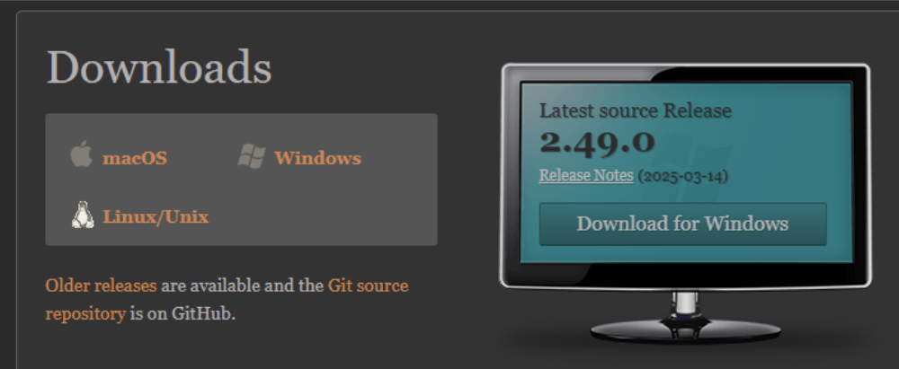

# Tutorial Completo: Git no Windows (com VS Code)

**Versão usada nos exemplos:** Git 2.49.0 (x64)  
**Público-alvo:** iniciantes e intermediários  
**Pré-requisitos:** Windows 10/11, internet, privilégios para instalar programas

---

## Sumário
1. [Baixar e instalar o Git e VS Code no Windows](#1-baixar-e-instalar-o-git-e-vs-code-no-windows)  
2. [Configuração inicial do Git](#2-configuração-inicial-do-git)  
3. [Criando e iniciando um repositório (VS Code)](#3-criando-e-iniciando-um-repositório-vs-code)  
4. [Criar arquivos e commit inicial (VS Code)](#4-criar-arquivos-e-commit-inicial-vs-code)  
5. [Trabalhando com branches (VS Code)](#5-trabalhando-com-branches-vs-code)  
6. [Criando e resolvendo conflitos no terminal](#6-criando-e-resolvendo-conflitos-no-terminal)  
7. [Criando e resolvendo conflitos no VS Code](#7-criando-e-resolvendo-conflitos-no-vs-code)  
8. [Visualizando histórico de commits no VS Code](#8-visualizando-histórico-de-commits-no-vs-code)  
9. [Clonando repositório via VS Code](#9-clonando-repositório-via-vs-code)  
10. [Sincronizando com GitHub pelo VS Code](#10-sincronizando-com-github-pelo-vs-code)  
11. [Dicas rápidas e comandos úteis](#11-dicas-rápidas-e-comandos-úteis)  
12. [Glossário rápido (opcional)](#12-glossário-rápido-opcional)  
13. [Como substituir as imagens de exemplo](#13-como-substituir-as-imagens-de-exemplo)  
14. [Licença](#14-licença)

---

## 1. Baixar e instalar o Git e VS Code no Windows

### 1.1 Git
1. Acesse: <https://git-scm.com/downloads>  
2. Clique em **Download for Windows** e execute o instalador.  
3. Siga a instalação padrão (**Next → Next → Finish**).  
4. Verifique no **Git Bash** ou **Prompt**:

```bash
git --version
# Exemplo de saída esperada:
# git version 2.49.0.windows.1
```
**Figura 1 — Página oficial do Git (botão “Download for Windows”)**


### 1.2 Visual Studio Code (VS Code)

1. Acesse: https://code.visualstudio.com/download
2. Baixe a versão para Windows e instale.
3. Abra o VS Code e confira **Help → About** (opcional).

**Figura 2 — Página oficial do VS Code (botão “Download for Windows”)**


>**Observação:** O VS Code já inclui integração com Git e tem extensões úteis como Git Graph e GitLens.

## 2. Configuração inicial do Git

Defina seu nome e e-mail (essas informações aparecem nos commits):

```sh
git config --global user.name "Seu Nome"
git config --global user.email "seu_email@email.com"
git config --list
```

**Figura 3 — Git Bash: configurando nome e e-mail**


>[!NOTE]
>- `--global` aplica a todos os repositórios do seu usuário.
>- `--local` (executado dentro de um repositório) sobrescreve o global apenas para aquele projeto.

## 3. Criando e iniciando um repositório (VS Code)

1. No **Windows Explorer**, crie a pasta desenvolvimento e dentro dela exemplo1.
2. Abra o VS Code → **File → Open Folder…** → selecione exemplo1.
3. Abra o terminal integrado (`Ctrl + ``) e execute:

```sh
git init
```

**Figura 4 — VS Code: File → Open Folder (Explorer com pasta exemplo1)**


**Figura 5 — VS Code: Terminal integrado após git init**


>Isso cria a pasta oculta `.git` no diretório, iniciando o repositório.

## 4. Criar arquivos e commit inicial (VS Code)

1. No Explorer, clique em **New File** e crie:
- `file1.txt` com o conteúdo `linha 1`
- `file2.txt` com o conteúdo `linha 1`
2. Abra **Source Control** (`Ctrl + Shift + G`).
3. Faça **Stage** dos arquivos (ícone + ao lado do arquivo) e escreva a mensagem de commit no campo de mensagem.
4. Clique em **Commit** (✓).

**Figura 6 — VS Code: Explorer com** `file1.txt` e `file2.txt`


Figura 7 — VS Code: Source Control com arquivos staged e campo de mensagem


Equivalente no terminal:

```sh
echo "linha 1" > file1.txt
echo "linha 1" > file2.txt
git add .
git commit -m "Adicionou arquivos file1.txt e file2.txt"
```

## 5. Trabalhando com branches (VS Code)

1. Clique no nome da branch na barra inferior (ex.: `main`).
2. Selecione Create New Branch e nomeie `branch1`, `branch2`, etc.
3. Para alternar entre branches, use o mesmo seletor ou a Command Palette (`Ctrl + Shift + P` → Git: Checkout to...).

Figura 8 — VS Code: menu “Current Branch” → Create New Branch


Comandos equivalentes no terminal:

```sh
git branch           # lista branches
git branch branch1
git branch branch2
git checkout branch1
# ou criar e trocar:
git checkout -b nova-feature
```

## 6. Criando e resolvendo conflitos no terminal

**Cenário:** duas branches alteram a mesma linha de `file1.txt`.

```sh
# (1) na main
git checkout main
echo "linha 1 - versão principal" > file1.txt
git add file1.txt
git commit -m "Alterou file1.txt na main"

# (2) criar branch e alterar
git checkout -b branch-conflito
echo "linha 1 - versão da branch-conflito" > file1.txt
git add file1.txt
git commit -m "Alterou file1.txt na branch-conflito"

# (3) voltar à main e alterar a mesma linha
git checkout main
echo "linha 1 - nova versão da main" > file1.txt
git add file1.txt
git commit -m "Nova alteração em file1.txt na main"

# (4) merge que gera conflito
git merge branch-conflito
```

Quando ocorrer conflito, `file1.txt` ficará assim:

```sh
<<<<<<< HEAD
linha 1 - nova versão da main
=======
linha 1 - versão da branch-conflito
>>>>>>> branch-conflito
```

**Resolver:**

1. Edite `file1.txt` e remova os marcadores `<<<<<<<`, `=======`, `>>>>>>>`, escolhendo a versão final (ou mesclando texto).
2. Em seguida:

```sh
git add file1.txt
git commit -m "Resolveu conflito entre main e branch-conflito"
```

**Visualizar histórico:**

```sh
git log --oneline --graph --all
```

## 7. Criando e resolvendo conflitos no VS Code

**Cenário:** conflito em `file2.txt`, resolvido visualmente.

1. Na `main`:

```sh
git checkout main
echo "linha 1 - versão principal" > file2.txt
git add file2.txt
git commit -m "Alterou file2.txt na main"
```

2. Criar branch e alterar:

```sh
git checkout -b branch-vscode
echo "linha 1 - versão da branch-vscode" > file2.txt
git add file2.txt
git commit -m "Alterou file2.txt na branch-vscode"
```

3. Voltar `main`, alterar a mesma linha:

```sh
git checkout main
echo "linha 1 - nova versão da main" > file2.txt
git add file2.txt
git commit -m "Nova alteração em file2.txt na main"
```

4. Tentar mesclar

```sh
git merge branch-vscode
```

— deve aparecer:

```pgsql
CONFLICT (content): Merge conflict in file2.txt
Automatic merge failed; fix conflicts and then commit the result.
```

5. No VS Code (`code .`):

- Abra `file2.txt`. Você verá os marcadores de conflito e **botões acima do bloco**:
    - **Accept Current Change** — mantém a versão da branch atual (HEAD/main).
    - **Accept Incoming Change** — mantém a versão da branch que está sendo mesclada.
    - **Accept Both Changes** — aceita ambas (mantém as duas).
    - **Compare Changes** — exibe diff lado a lado.


**Figura 9 — VS Code: diff de conflito com botões de resolução**


6. Após escolher/editar, finalize:

```sh
git add file2.txt
git commit -m "Resolveu conflito de file2.txt usando VS Code"
```

## 8. Visualizando histórico de commits no VS Code

- **Timeline:** abra um arquivo e acesse a aba Timeline (painel do arquivo) para ver alterações daquele arquivo.
- **Git Graph:** instale a extensão Git Graph para visualizar grafo de commits e branches de forma interativa.
- **GitLens** também fornece histórico detalhado por linha e autor.

**Figura 10 — VS Code: Timeline mostrando histórico do arquivo**


**Figura 11 — VS Code: extensão Git Graph mostrando grafo de commits**


## 9. Clonando repositório via VS Code

1. Abra **Command Palette** (`Ctrl + Shift + P`) → digite **Git: Clone**.
2. Cole a URL HTTPS (ex.: `https://github.com/usuario/repositorio.git`).
3. Escolha a pasta destino e abra o repositório clonado no VS Code.

`Figura 12 — VS Code: Command Palette com “Git: Clone”`


## 10. Sincronizando com GitHub pelo VS Code

- Para publicar a branch local: clique em **Publish Branch** na barra inferior. Siga o fluxo de login/autorizações para conectar à sua conta GitHub.
- Para sincronizar (push + pull), use **Source Control → Sync Changes**.

**Figura 13 — VS Code: botão “Publish Branch” e prompt de login GitHub**


**Figura 14 — VS Code: Source Control com “Sync Changes”**


**Comandos equivalentes no terminal:**

```sh
git remote add origin https://github.com/usuario/repositorio.git
git push -u origin main   # primeiro push com upstream
git pull                  # atualizar local
git push                  # enviar commits
```

## 11. Dicas rápidas e comandos úteis

**Status e diferenças**

```sh
git status        # o que mudou desde o último commit
git diff          # diferenças não stageadas
git diff --staged # diferenças já no stage
```

**Histórico**

```sh
git log
git log --oneline --graph --decorate --all
```

**Desfazer (com segurança)**

```sh
git restore caminho/arquivo          # descarta mudanças locais não stageadas
git restore --staged caminho/arquivo # tira do stage
git checkout -- caminho/arquivo      # alternativa clássica (antes do restore)
```

**Branches**

```sh
git branch                 # listar
git checkout nome-branch   # trocar
git checkout -b nova       # criar e trocar
git merge outra-branch     # mesclar na branch atual
git branch -d nome-branch  # apagar (quando já mesclada)
```

**Remoto (GitHub)**

```sh
git remote add origin https://github.com/usuario/repositorio.git
git push -u origin main
git pull
git push
```

**Resolução de conflitos (resumo)**

1. Identificar arquivos em conflito: `git status`
2. Editar arquivos removendo marcadores `<<<<<<< >>>>>>> =======` e escolhendo a versão desejada
3. `git add arquivo`
4. `git commit -m "Resolveu conflito ..."`

## 12. Glossário rápido

- **Repositório:** pasta com histórico de versionamento (.git).
- **Commit:** snapshot do estado do projeto com mensagem.
- **Stage / Index:** área de preparação antes do commit.
- **Branch:** linha paralela de desenvolvimento.
- **Merge:** unir mudanças de uma branch em outra.
- **HEAD:** referência para o commit/branch atual.
- **Remote:** repositório remoto (ex.: GitHub).
- **Push / Pull:** enviar / baixar alterações entre local e remoto.